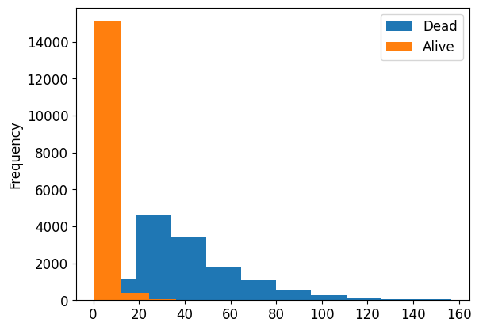
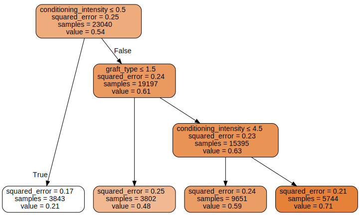

# tree_baseline


<!-- WARNING: THIS FILE WAS AUTOGENERATED! DO NOT EDIT! -->

``` python
try: import kaggle_hct_survival
except:
    !pip install git+https://github.com/ozpau/kaggle_hct_survival.git
```

``` python
train = pd.read_csv(path/"train.csv", index_col=0)
test = pd.read_csv(path/"test.csv", index_col=0)
desc = pd.read_csv(path/"data_dictionary.csv", index_col=0).T
sample_sub = pd.read_csv(path/"sample_submission.csv", index_col=0)

train.shape, test.shape
```

    ((28800, 59), (3, 57))

It appears that there are `58` columns in the testing data. One of them
is the target variable, but what is the other one?

``` python
ys = train.columns.difference(test.columns)
ys
```

    Index(['efs', 'efs_time'], dtype='object')

What are these columns for?

``` python
desc[ys].T
```

<div>
<style scoped>
    .dataframe tbody tr th:only-of-type {
        vertical-align: middle;
    }
&#10;    .dataframe tbody tr th {
        vertical-align: top;
    }
&#10;    .dataframe thead th {
        text-align: right;
    }
</style>

<table class="dataframe" data-quarto-postprocess="true" data-border="1">
<thead>
<tr style="text-align: right;">
<th data-quarto-table-cell-role="th"></th>
<th data-quarto-table-cell-role="th">description</th>
<th data-quarto-table-cell-role="th">type</th>
<th data-quarto-table-cell-role="th">values</th>
</tr>
<tr>
<th data-quarto-table-cell-role="th">variable</th>
<th data-quarto-table-cell-role="th"></th>
<th data-quarto-table-cell-role="th"></th>
<th data-quarto-table-cell-role="th"></th>
</tr>
</thead>
<tbody>
<tr>
<td data-quarto-table-cell-role="th">efs</td>
<td>Event-free survival</td>
<td>Categorical</td>
<td>['Event' 'Censoring']</td>
</tr>
<tr>
<td data-quarto-table-cell-role="th">efs_time</td>
<td>Time to event-free survival, months</td>
<td>Numerical</td>
<td>NaN</td>
</tr>
</tbody>
</table>

</div>

``` python
dep_vars = ["efs", "efs_time"]
```

``` python
sample_sub.columns
```

    Index(['prediction'], dtype='object')

From the dataset description: \> The primary outcome of interest is
event-free survival, represented by the variable efs, while the time to
event-free survival is captured by the variable efs_time. These two
variables together encode the target for a censored time-to-event
analysis.

https://www.cancer.gov/publications/dictionaries/cancer-terms/def/event-free-survival

### event-free survival

> In cancer, the length of time after primary treatment for a cancer
> ends that the patient remains free of certain complications or events
> that the treatment was intended to prevent or delay. These events may
> include the return of the cancer or the onset of certain symptoms,
> such as bone pain from cancer that has spread to the bone. In a
> clinical trial, measuring the event-free survival is one way to see
> how well a new treatment works. Also called EFS.

So, here’s a picture: we have a treatment and we observe a population of
patients.

For some of the patients, they live normally, but others face events.
When a patient faces an event, we can record the time between treatment
and event.

But for patients that haven’t experienced event, we can’t compute the
time between treatment and event. I suppose there could be two cases.
One is that the patient is still alive and haven’t experienced an event.
And another is that the patient is deceased but for an unrelated cause
(for example, a car accident).

So, what we want to know is would we be able to observe an event or not?
In other words, would the treatment benefit the patient?

Naturally, for testing dataset, if treatment has been administered
recently, it is reasonable to expect that we shouldn’t have had observed
any events yet. So I suspect that the testing dataset consists of
patients with treatment dates sampled uniformly across all available
treatment dates.

``` python
time_vars = ['year_hct', 'donor_age', 'age_at_hct']
train[time_vars].describe()
```

<div>
<style scoped>
    .dataframe tbody tr th:only-of-type {
        vertical-align: middle;
    }
&#10;    .dataframe tbody tr th {
        vertical-align: top;
    }
&#10;    .dataframe thead th {
        text-align: right;
    }
</style>

<table class="dataframe" data-quarto-postprocess="true" data-border="1">
<thead>
<tr style="text-align: right;">
<th data-quarto-table-cell-role="th"></th>
<th data-quarto-table-cell-role="th">year_hct</th>
<th data-quarto-table-cell-role="th">donor_age</th>
<th data-quarto-table-cell-role="th">age_at_hct</th>
</tr>
</thead>
<tbody>
<tr>
<td data-quarto-table-cell-role="th">count</td>
<td>28800.000000</td>
<td>26992.000000</td>
<td>28800.000000</td>
</tr>
<tr>
<td data-quarto-table-cell-role="th">mean</td>
<td>2015.179444</td>
<td>42.511591</td>
<td>38.663162</td>
</tr>
<tr>
<td data-quarto-table-cell-role="th">std</td>
<td>3.153914</td>
<td>15.251434</td>
<td>21.147581</td>
</tr>
<tr>
<td data-quarto-table-cell-role="th">min</td>
<td>2008.000000</td>
<td>18.010000</td>
<td>0.044000</td>
</tr>
<tr>
<td data-quarto-table-cell-role="th">25%</td>
<td>2013.000000</td>
<td>28.447000</td>
<td>19.539000</td>
</tr>
<tr>
<td data-quarto-table-cell-role="th">50%</td>
<td>2016.000000</td>
<td>40.063000</td>
<td>41.006000</td>
</tr>
<tr>
<td data-quarto-table-cell-role="th">75%</td>
<td>2018.000000</td>
<td>56.131500</td>
<td>55.965250</td>
</tr>
<tr>
<td data-quarto-table-cell-role="th">max</td>
<td>2020.000000</td>
<td>84.800000</td>
<td>73.726000</td>
</tr>
</tbody>
</table>

</div>

``` python
test[time_vars]
```

<div>
<style scoped>
    .dataframe tbody tr th:only-of-type {
        vertical-align: middle;
    }
&#10;    .dataframe tbody tr th {
        vertical-align: top;
    }
&#10;    .dataframe thead th {
        text-align: right;
    }
</style>

<table class="dataframe" data-quarto-postprocess="true" data-border="1">
<thead>
<tr style="text-align: right;">
<th data-quarto-table-cell-role="th"></th>
<th data-quarto-table-cell-role="th">year_hct</th>
<th data-quarto-table-cell-role="th">donor_age</th>
<th data-quarto-table-cell-role="th">age_at_hct</th>
</tr>
<tr>
<th data-quarto-table-cell-role="th">ID</th>
<th data-quarto-table-cell-role="th"></th>
<th data-quarto-table-cell-role="th"></th>
<th data-quarto-table-cell-role="th"></th>
</tr>
</thead>
<tbody>
<tr>
<td data-quarto-table-cell-role="th">28800</td>
<td>2016</td>
<td>NaN</td>
<td>9.942</td>
</tr>
<tr>
<td data-quarto-table-cell-role="th">28801</td>
<td>2008</td>
<td>72.29</td>
<td>43.705</td>
</tr>
<tr>
<td data-quarto-table-cell-role="th">28802</td>
<td>2019</td>
<td>NaN</td>
<td>33.997</td>
</tr>
</tbody>
</table>

</div>

## Preprocess the data

Let’s join testing and training data for convenience into one dataframe
and let’s also preprocess categorical and missing data

``` python
pvalid = 0.2
#train.loc[len(train)
```

## Understanding outcomes

``` python
sample_sub.head().T
```

<div>
<style scoped>
    .dataframe tbody tr th:only-of-type {
        vertical-align: middle;
    }
&#10;    .dataframe tbody tr th {
        vertical-align: top;
    }
&#10;    .dataframe thead th {
        text-align: right;
    }
</style>

<table class="dataframe" data-quarto-postprocess="true" data-border="1">
<thead>
<tr style="text-align: right;">
<th data-quarto-table-cell-role="th">ID</th>
<th data-quarto-table-cell-role="th">28800</th>
<th data-quarto-table-cell-role="th">28801</th>
<th data-quarto-table-cell-role="th">28802</th>
</tr>
</thead>
<tbody>
<tr>
<td data-quarto-table-cell-role="th">prediction</td>
<td>0.5</td>
<td>0.5</td>
<td>0.5</td>
</tr>
</tbody>
</table>

</div>

``` python
vars_submit = ["efs"]
train[vars_submit].sample(5).T
```

<div>
<style scoped>
    .dataframe tbody tr th:only-of-type {
        vertical-align: middle;
    }
&#10;    .dataframe tbody tr th {
        vertical-align: top;
    }
&#10;    .dataframe thead th {
        text-align: right;
    }
</style>

<table class="dataframe" data-quarto-postprocess="true" data-border="1">
<thead>
<tr style="text-align: right;">
<th data-quarto-table-cell-role="th">ID</th>
<th data-quarto-table-cell-role="th">18932</th>
<th data-quarto-table-cell-role="th">21280</th>
<th data-quarto-table-cell-role="th">27880</th>
<th data-quarto-table-cell-role="th">15692</th>
<th data-quarto-table-cell-role="th">25416</th>
</tr>
</thead>
<tbody>
<tr>
<td data-quarto-table-cell-role="th">efs</td>
<td>0.0</td>
<td>1.0</td>
<td>1.0</td>
<td>1.0</td>
<td>1.0</td>
</tr>
</tbody>
</table>

</div>

``` python
train[vars_submit].value_counts()
```

    efs
    1.0    15532
    0.0    13268
    Name: count, dtype: int64

Makes sense. A person either survives or not.

But there is also time to survival. Is there some masking envolved?

``` python
train.query('efs == 0')['efs_time'].plot.hist(label="Dead")
train.query('efs == 1')['efs_time'].plot.hist(label="Alive")
plt.legend()
```



## Validation set

Lets select validation set and join all data into one dataframe for ease
of use.

But first, we need to understand what kind of sampling differences are
to expect from the testing dataset. - Is it going to be sampled from the
same prior distribution as the testing set? - Is it going to be sampled
for future patients? - Is

## Scratch Work

``` python
train_conds = np.arange(len(train)) < len(train)*0.8

train_idx = np.where( train_conds)[0]
valid_idx = np.where(~train_conds)[0]
splits = (list(train_idx), list(valid_idx))

procs = [Categorify, FillMissing]
cont,cat = cont_cat_split(train, 40, dep_var=dep_vars)
```

``` python
with warnings.catch_warnings():
    warnings.simplefilter('ignore')
    # debug
    to = TabularPandas(train, procs, cat, cont, y_names=dep_vars, splits=splits)
    #to = TabularPandas(train.drop(, procs, cat, cont, y_names=dep_vars, splits=splits)
```

``` python
def preprocess_test_data(to):
    with warnings.catch_warnings():
        warnings.simplefilter('ignore')
        dls = to.dataloaders()
        dl = dls.test_dl(test)
        return dl.dataset.items
```

``` python
processed_test = preprocess_test_data(to)
```

``` python
'efs' in processed_test or 'efs_time' in processed_test
```

    False

``` python
'efs_time' in processed_test.columns
```

    False

``` python
list(zip(to.items.drop(columns=['efs','efs_time']).columns, processed_test.columns))
```

    [('dri_score', 'dri_score'),
     ('psych_disturb', 'psych_disturb'),
     ('cyto_score', 'cyto_score'),
     ('diabetes', 'diabetes'),
     ('hla_match_c_high', 'hla_match_c_high'),
     ('hla_high_res_8', 'hla_high_res_8'),
     ('tbi_status', 'tbi_status'),
     ('arrhythmia', 'arrhythmia'),
     ('hla_low_res_6', 'hla_low_res_6'),
     ('graft_type', 'graft_type'),
     ('vent_hist', 'vent_hist'),
     ('renal_issue', 'renal_issue'),
     ('pulm_severe', 'pulm_severe'),
     ('prim_disease_hct', 'prim_disease_hct'),
     ('hla_high_res_6', 'hla_high_res_6'),
     ('cmv_status', 'cmv_status'),
     ('hla_high_res_10', 'hla_high_res_10'),
     ('hla_match_dqb1_high', 'hla_match_dqb1_high'),
     ('tce_imm_match', 'tce_imm_match'),
     ('hla_nmdp_6', 'hla_nmdp_6'),
     ('hla_match_c_low', 'hla_match_c_low'),
     ('rituximab', 'rituximab'),
     ('hla_match_drb1_low', 'hla_match_drb1_low'),
     ('hla_match_dqb1_low', 'hla_match_dqb1_low'),
     ('prod_type', 'prod_type'),
     ('cyto_score_detail', 'cyto_score_detail'),
     ('conditioning_intensity', 'conditioning_intensity'),
     ('ethnicity', 'ethnicity'),
     ('year_hct', 'year_hct'),
     ('obesity', 'obesity'),
     ('mrd_hct', 'mrd_hct'),
     ('in_vivo_tcd', 'in_vivo_tcd'),
     ('tce_match', 'tce_match'),
     ('hla_match_a_high', 'hla_match_a_high'),
     ('hepatic_severe', 'hepatic_severe'),
     ('donor_age', 'donor_age'),
     ('prior_tumor', 'prior_tumor'),
     ('hla_match_b_low', 'hla_match_b_low'),
     ('peptic_ulcer', 'peptic_ulcer'),
     ('age_at_hct', 'age_at_hct'),
     ('hla_match_a_low', 'hla_match_a_low'),
     ('gvhd_proph', 'gvhd_proph'),
     ('rheum_issue', 'rheum_issue'),
     ('sex_match', 'sex_match'),
     ('hla_match_b_high', 'hla_match_b_high'),
     ('race_group', 'race_group'),
     ('comorbidity_score', 'comorbidity_score'),
     ('karnofsky_score', 'karnofsky_score'),
     ('hepatic_mild', 'hepatic_mild'),
     ('tce_div_match', 'tce_div_match'),
     ('donor_related', 'donor_related'),
     ('melphalan_dose', 'melphalan_dose'),
     ('hla_low_res_8', 'hla_low_res_8'),
     ('cardiac', 'cardiac'),
     ('hla_match_drb1_high', 'hla_match_drb1_high'),
     ('pulm_moderate', 'pulm_moderate'),
     ('hla_low_res_10', 'hla_low_res_10'),
     ('hla_match_c_high_na', 'hla_match_c_high_na'),
     ('hla_high_res_8_na', 'hla_high_res_8_na'),
     ('hla_low_res_6_na', 'hla_low_res_6_na'),
     ('hla_high_res_6_na', 'hla_high_res_6_na'),
     ('hla_high_res_10_na', 'hla_high_res_10_na'),
     ('hla_match_dqb1_high_na', 'hla_match_dqb1_high_na'),
     ('hla_nmdp_6_na', 'hla_nmdp_6_na'),
     ('hla_match_c_low_na', 'hla_match_c_low_na'),
     ('hla_match_drb1_low_na', 'hla_match_drb1_low_na'),
     ('hla_match_dqb1_low_na', 'hla_match_dqb1_low_na'),
     ('hla_match_a_high_na', 'hla_match_a_high_na'),
     ('donor_age_na', 'donor_age_na'),
     ('hla_match_b_low_na', 'hla_match_b_low_na'),
     ('hla_match_a_low_na', 'hla_match_a_low_na'),
     ('hla_match_b_high_na', 'hla_match_b_high_na'),
     ('comorbidity_score_na', 'comorbidity_score_na'),
     ('karnofsky_score_na', 'karnofsky_score_na'),
     ('hla_low_res_8_na', 'hla_low_res_8_na'),
     ('hla_match_drb1_high_na', 'hla_match_drb1_high_na'),
     ('hla_low_res_10_na', 'hla_low_res_10_na')]

``` python
processed_test.columns
```

    Index(['dri_score', 'psych_disturb', 'cyto_score', 'diabetes',
           'hla_match_c_high', 'hla_high_res_8', 'tbi_status', 'arrhythmia',
           'hla_low_res_6', 'graft_type', 'vent_hist', 'renal_issue',
           'pulm_severe', 'prim_disease_hct', 'hla_high_res_6', 'cmv_status',
           'hla_high_res_10', 'hla_match_dqb1_high', 'tce_imm_match', 'hla_nmdp_6',
           'hla_match_c_low', 'rituximab', 'hla_match_drb1_low',
           'hla_match_dqb1_low', 'prod_type', 'cyto_score_detail',
           'conditioning_intensity', 'ethnicity', 'year_hct', 'obesity', 'mrd_hct',
           'in_vivo_tcd', 'tce_match', 'hla_match_a_high', 'hepatic_severe',
           'donor_age', 'prior_tumor', 'hla_match_b_low', 'peptic_ulcer',
           'age_at_hct', 'hla_match_a_low', 'gvhd_proph', 'rheum_issue',
           'sex_match', 'hla_match_b_high', 'race_group', 'comorbidity_score',
           'karnofsky_score', 'hepatic_mild', 'tce_div_match', 'donor_related',
           'melphalan_dose', 'hla_low_res_8', 'cardiac', 'hla_match_drb1_high',
           'pulm_moderate', 'hla_low_res_10', 'hla_match_c_high_na',
           'hla_high_res_8_na', 'hla_low_res_6_na', 'hla_high_res_6_na',
           'hla_high_res_10_na', 'hla_match_dqb1_high_na', 'hla_nmdp_6_na',
           'hla_match_c_low_na', 'hla_match_drb1_low_na', 'hla_match_dqb1_low_na',
           'hla_match_a_high_na', 'donor_age_na', 'hla_match_b_low_na',
           'hla_match_a_low_na', 'hla_match_b_high_na', 'comorbidity_score_na',
           'karnofsky_score_na', 'hla_low_res_8_na', 'hla_match_drb1_high_na',
           'hla_low_res_10_na'],
          dtype='object')

``` python
pd.concat([train,test]).shape, train.shape, test.shape
```

    ((28803, 59), (28800, 59), (3, 57))

def fill_test(): train_conds = np.arange(len(train) + len(test)) \<
len(train)

    train_idx = np.where( train_conds)[0]
    valid_idx = np.where(~train_conds)[0]
    splits = (list(train_idx), list(valid_idx))

    df = pd.concat([train,test]).copy()
    with warnings.catch_warnings():
        warnings.simplefilter('ignore')
        to = TabularPandas(df, procs, cat, cont);
    return to.items.iloc[len(train):].drop(columns=['efs', 'efs_time'])

fill_test()

``` python
xs,y = to.train.xs,to.train.y
valid_xs,valid_y = to.valid.xs,to.valid.y
```

``` python
m = DecisionTreeRegressor(max_leaf_nodes=4)
m.fit(xs, y);

draw_tree(m, xs, size=10, leaves_parallel=True, precision=2)
```



``` python
desc['conditioning_intensity']
```

    description                                                Computed planned conditioning intensity
    type                                                                                   Categorical
    values         ['RIC' nan 'NMA' 'MAC' 'TBD' 'No drugs reported'\n 'N/A, F(pre-TED) not submitted']
    Name: conditioning_intensity, dtype: object

``` python
to.classes['conditioning_intensity']
```

    ['#na#', 'MAC', 'N/A, F(pre-TED) not submitted', 'NMA', 'No drugs reported', 'RIC', 'TBD']

``` python
to.classes['graft_type']
```

    ['#na#', 'Bone marrow', 'Peripheral blood']

``` python
len(preprocess_test_data(to).columns), len(m.feature_names_in_)
```

    (77, 77)

``` python
df = preprocess_test_data(to)
df.reindex(columns = m.feature_names_in_)
```

<div>
<style scoped>
    .dataframe tbody tr th:only-of-type {
        vertical-align: middle;
    }
&#10;    .dataframe tbody tr th {
        vertical-align: top;
    }
&#10;    .dataframe thead th {
        text-align: right;
    }
</style>

<table class="dataframe" data-quarto-postprocess="true" data-border="1">
<thead>
<tr style="text-align: right;">
<th data-quarto-table-cell-role="th"></th>
<th data-quarto-table-cell-role="th">dri_score</th>
<th data-quarto-table-cell-role="th">psych_disturb</th>
<th data-quarto-table-cell-role="th">cyto_score</th>
<th data-quarto-table-cell-role="th">diabetes</th>
<th data-quarto-table-cell-role="th">tbi_status</th>
<th data-quarto-table-cell-role="th">arrhythmia</th>
<th data-quarto-table-cell-role="th">graft_type</th>
<th data-quarto-table-cell-role="th">vent_hist</th>
<th data-quarto-table-cell-role="th">renal_issue</th>
<th data-quarto-table-cell-role="th">pulm_severe</th>
<th data-quarto-table-cell-role="th">prim_disease_hct</th>
<th data-quarto-table-cell-role="th">cmv_status</th>
<th data-quarto-table-cell-role="th">tce_imm_match</th>
<th data-quarto-table-cell-role="th">rituximab</th>
<th data-quarto-table-cell-role="th">prod_type</th>
<th data-quarto-table-cell-role="th">cyto_score_detail</th>
<th data-quarto-table-cell-role="th">conditioning_intensity</th>
<th data-quarto-table-cell-role="th">ethnicity</th>
<th data-quarto-table-cell-role="th">year_hct</th>
<th data-quarto-table-cell-role="th">obesity</th>
<th data-quarto-table-cell-role="th">mrd_hct</th>
<th data-quarto-table-cell-role="th">in_vivo_tcd</th>
<th data-quarto-table-cell-role="th">tce_match</th>
<th data-quarto-table-cell-role="th">hepatic_severe</th>
<th data-quarto-table-cell-role="th">prior_tumor</th>
<th data-quarto-table-cell-role="th">peptic_ulcer</th>
<th data-quarto-table-cell-role="th">gvhd_proph</th>
<th data-quarto-table-cell-role="th">rheum_issue</th>
<th data-quarto-table-cell-role="th">sex_match</th>
<th data-quarto-table-cell-role="th">race_group</th>
<th data-quarto-table-cell-role="th">hepatic_mild</th>
<th data-quarto-table-cell-role="th">tce_div_match</th>
<th data-quarto-table-cell-role="th">donor_related</th>
<th data-quarto-table-cell-role="th">melphalan_dose</th>
<th data-quarto-table-cell-role="th">cardiac</th>
<th data-quarto-table-cell-role="th">pulm_moderate</th>
<th data-quarto-table-cell-role="th">hla_match_c_high_na</th>
<th data-quarto-table-cell-role="th">hla_high_res_8_na</th>
<th data-quarto-table-cell-role="th">hla_low_res_6_na</th>
<th data-quarto-table-cell-role="th">hla_high_res_6_na</th>
<th data-quarto-table-cell-role="th">hla_high_res_10_na</th>
<th data-quarto-table-cell-role="th">hla_match_dqb1_high_na</th>
<th data-quarto-table-cell-role="th">hla_nmdp_6_na</th>
<th data-quarto-table-cell-role="th">hla_match_c_low_na</th>
<th data-quarto-table-cell-role="th">hla_match_drb1_low_na</th>
<th data-quarto-table-cell-role="th">hla_match_dqb1_low_na</th>
<th data-quarto-table-cell-role="th">hla_match_a_high_na</th>
<th data-quarto-table-cell-role="th">donor_age_na</th>
<th data-quarto-table-cell-role="th">hla_match_b_low_na</th>
<th data-quarto-table-cell-role="th">hla_match_a_low_na</th>
<th data-quarto-table-cell-role="th">hla_match_b_high_na</th>
<th data-quarto-table-cell-role="th">comorbidity_score_na</th>
<th data-quarto-table-cell-role="th">karnofsky_score_na</th>
<th data-quarto-table-cell-role="th">hla_low_res_8_na</th>
<th data-quarto-table-cell-role="th">hla_match_drb1_high_na</th>
<th data-quarto-table-cell-role="th">hla_low_res_10_na</th>
<th data-quarto-table-cell-role="th">hla_match_c_high</th>
<th data-quarto-table-cell-role="th">hla_high_res_8</th>
<th data-quarto-table-cell-role="th">hla_low_res_6</th>
<th data-quarto-table-cell-role="th">hla_high_res_6</th>
<th data-quarto-table-cell-role="th">hla_high_res_10</th>
<th data-quarto-table-cell-role="th">hla_match_dqb1_high</th>
<th data-quarto-table-cell-role="th">hla_nmdp_6</th>
<th data-quarto-table-cell-role="th">hla_match_c_low</th>
<th data-quarto-table-cell-role="th">hla_match_drb1_low</th>
<th data-quarto-table-cell-role="th">hla_match_dqb1_low</th>
<th data-quarto-table-cell-role="th">hla_match_a_high</th>
<th data-quarto-table-cell-role="th">donor_age</th>
<th data-quarto-table-cell-role="th">hla_match_b_low</th>
<th data-quarto-table-cell-role="th">age_at_hct</th>
<th data-quarto-table-cell-role="th">hla_match_a_low</th>
<th data-quarto-table-cell-role="th">hla_match_b_high</th>
<th data-quarto-table-cell-role="th">comorbidity_score</th>
<th data-quarto-table-cell-role="th">karnofsky_score</th>
<th data-quarto-table-cell-role="th">hla_low_res_8</th>
<th data-quarto-table-cell-role="th">hla_match_drb1_high</th>
<th data-quarto-table-cell-role="th">hla_low_res_10</th>
</tr>
<tr>
<th data-quarto-table-cell-role="th">ID</th>
<th data-quarto-table-cell-role="th"></th>
<th data-quarto-table-cell-role="th"></th>
<th data-quarto-table-cell-role="th"></th>
<th data-quarto-table-cell-role="th"></th>
<th data-quarto-table-cell-role="th"></th>
<th data-quarto-table-cell-role="th"></th>
<th data-quarto-table-cell-role="th"></th>
<th data-quarto-table-cell-role="th"></th>
<th data-quarto-table-cell-role="th"></th>
<th data-quarto-table-cell-role="th"></th>
<th data-quarto-table-cell-role="th"></th>
<th data-quarto-table-cell-role="th"></th>
<th data-quarto-table-cell-role="th"></th>
<th data-quarto-table-cell-role="th"></th>
<th data-quarto-table-cell-role="th"></th>
<th data-quarto-table-cell-role="th"></th>
<th data-quarto-table-cell-role="th"></th>
<th data-quarto-table-cell-role="th"></th>
<th data-quarto-table-cell-role="th"></th>
<th data-quarto-table-cell-role="th"></th>
<th data-quarto-table-cell-role="th"></th>
<th data-quarto-table-cell-role="th"></th>
<th data-quarto-table-cell-role="th"></th>
<th data-quarto-table-cell-role="th"></th>
<th data-quarto-table-cell-role="th"></th>
<th data-quarto-table-cell-role="th"></th>
<th data-quarto-table-cell-role="th"></th>
<th data-quarto-table-cell-role="th"></th>
<th data-quarto-table-cell-role="th"></th>
<th data-quarto-table-cell-role="th"></th>
<th data-quarto-table-cell-role="th"></th>
<th data-quarto-table-cell-role="th"></th>
<th data-quarto-table-cell-role="th"></th>
<th data-quarto-table-cell-role="th"></th>
<th data-quarto-table-cell-role="th"></th>
<th data-quarto-table-cell-role="th"></th>
<th data-quarto-table-cell-role="th"></th>
<th data-quarto-table-cell-role="th"></th>
<th data-quarto-table-cell-role="th"></th>
<th data-quarto-table-cell-role="th"></th>
<th data-quarto-table-cell-role="th"></th>
<th data-quarto-table-cell-role="th"></th>
<th data-quarto-table-cell-role="th"></th>
<th data-quarto-table-cell-role="th"></th>
<th data-quarto-table-cell-role="th"></th>
<th data-quarto-table-cell-role="th"></th>
<th data-quarto-table-cell-role="th"></th>
<th data-quarto-table-cell-role="th"></th>
<th data-quarto-table-cell-role="th"></th>
<th data-quarto-table-cell-role="th"></th>
<th data-quarto-table-cell-role="th"></th>
<th data-quarto-table-cell-role="th"></th>
<th data-quarto-table-cell-role="th"></th>
<th data-quarto-table-cell-role="th"></th>
<th data-quarto-table-cell-role="th"></th>
<th data-quarto-table-cell-role="th"></th>
<th data-quarto-table-cell-role="th"></th>
<th data-quarto-table-cell-role="th"></th>
<th data-quarto-table-cell-role="th"></th>
<th data-quarto-table-cell-role="th"></th>
<th data-quarto-table-cell-role="th"></th>
<th data-quarto-table-cell-role="th"></th>
<th data-quarto-table-cell-role="th"></th>
<th data-quarto-table-cell-role="th"></th>
<th data-quarto-table-cell-role="th"></th>
<th data-quarto-table-cell-role="th"></th>
<th data-quarto-table-cell-role="th"></th>
<th data-quarto-table-cell-role="th"></th>
<th data-quarto-table-cell-role="th"></th>
<th data-quarto-table-cell-role="th"></th>
<th data-quarto-table-cell-role="th"></th>
<th data-quarto-table-cell-role="th"></th>
<th data-quarto-table-cell-role="th"></th>
<th data-quarto-table-cell-role="th"></th>
<th data-quarto-table-cell-role="th"></th>
<th data-quarto-table-cell-role="th"></th>
<th data-quarto-table-cell-role="th"></th>
</tr>
</thead>
<tbody>
<tr>
<td data-quarto-table-cell-role="th">28800</td>
<td>8</td>
<td>1</td>
<td>0</td>
<td>1</td>
<td>1</td>
<td>1</td>
<td>1</td>
<td>1</td>
<td>1</td>
<td>1</td>
<td>7</td>
<td>1</td>
<td>0</td>
<td>1</td>
<td>1</td>
<td>0</td>
<td>0</td>
<td>3</td>
<td>9</td>
<td>1</td>
<td>0</td>
<td>2</td>
<td>0</td>
<td>1</td>
<td>1</td>
<td>1</td>
<td>12</td>
<td>1</td>
<td>3</td>
<td>4</td>
<td>1</td>
<td>0</td>
<td>3</td>
<td>2</td>
<td>1</td>
<td>1</td>
<td>2</td>
<td>2</td>
<td>1</td>
<td>1</td>
<td>2</td>
<td>1</td>
<td>1</td>
<td>1</td>
<td>1</td>
<td>1</td>
<td>1</td>
<td>2</td>
<td>1</td>
<td>1</td>
<td>1</td>
<td>1</td>
<td>1</td>
<td>1</td>
<td>1</td>
<td>1</td>
<td>2.0</td>
<td>8.0</td>
<td>6.0</td>
<td>6.0</td>
<td>10.0</td>
<td>2.0</td>
<td>6.0</td>
<td>2.0</td>
<td>2.0</td>
<td>2.0</td>
<td>2.0</td>
<td>40.153999</td>
<td>2.0</td>
<td>9.942</td>
<td>2.0</td>
<td>2.0</td>
<td>0.0</td>
<td>90.0</td>
<td>8.0</td>
<td>2.0</td>
<td>10.0</td>
</tr>
<tr>
<td data-quarto-table-cell-role="th">28801</td>
<td>3</td>
<td>1</td>
<td>2</td>
<td>1</td>
<td>7</td>
<td>1</td>
<td>2</td>
<td>1</td>
<td>1</td>
<td>1</td>
<td>3</td>
<td>1</td>
<td>8</td>
<td>1</td>
<td>2</td>
<td>2</td>
<td>1</td>
<td>3</td>
<td>1</td>
<td>1</td>
<td>2</td>
<td>1</td>
<td>4</td>
<td>1</td>
<td>1</td>
<td>1</td>
<td>14</td>
<td>1</td>
<td>1</td>
<td>2</td>
<td>1</td>
<td>4</td>
<td>2</td>
<td>2</td>
<td>1</td>
<td>3</td>
<td>1</td>
<td>1</td>
<td>1</td>
<td>1</td>
<td>1</td>
<td>1</td>
<td>1</td>
<td>1</td>
<td>1</td>
<td>1</td>
<td>1</td>
<td>1</td>
<td>1</td>
<td>1</td>
<td>1</td>
<td>1</td>
<td>1</td>
<td>1</td>
<td>1</td>
<td>1</td>
<td>2.0</td>
<td>8.0</td>
<td>6.0</td>
<td>6.0</td>
<td>10.0</td>
<td>2.0</td>
<td>6.0</td>
<td>2.0</td>
<td>2.0</td>
<td>2.0</td>
<td>2.0</td>
<td>72.290000</td>
<td>2.0</td>
<td>43.705</td>
<td>2.0</td>
<td>2.0</td>
<td>3.0</td>
<td>90.0</td>
<td>8.0</td>
<td>2.0</td>
<td>10.0</td>
</tr>
<tr>
<td data-quarto-table-cell-role="th">28802</td>
<td>8</td>
<td>1</td>
<td>0</td>
<td>1</td>
<td>1</td>
<td>1</td>
<td>1</td>
<td>1</td>
<td>1</td>
<td>1</td>
<td>6</td>
<td>1</td>
<td>8</td>
<td>1</td>
<td>1</td>
<td>0</td>
<td>0</td>
<td>3</td>
<td>12</td>
<td>1</td>
<td>0</td>
<td>2</td>
<td>0</td>
<td>1</td>
<td>1</td>
<td>1</td>
<td>8</td>
<td>1</td>
<td>2</td>
<td>4</td>
<td>1</td>
<td>4</td>
<td>2</td>
<td>2</td>
<td>1</td>
<td>1</td>
<td>1</td>
<td>1</td>
<td>1</td>
<td>1</td>
<td>1</td>
<td>1</td>
<td>1</td>
<td>1</td>
<td>1</td>
<td>1</td>
<td>1</td>
<td>2</td>
<td>1</td>
<td>1</td>
<td>1</td>
<td>1</td>
<td>1</td>
<td>1</td>
<td>1</td>
<td>1</td>
<td>2.0</td>
<td>8.0</td>
<td>6.0</td>
<td>6.0</td>
<td>10.0</td>
<td>2.0</td>
<td>6.0</td>
<td>2.0</td>
<td>2.0</td>
<td>2.0</td>
<td>2.0</td>
<td>40.153999</td>
<td>2.0</td>
<td>33.997</td>
<td>2.0</td>
<td>2.0</td>
<td>0.0</td>
<td>90.0</td>
<td>8.0</td>
<td>2.0</td>
<td>10.0</td>
</tr>
</tbody>
</table>

</div>

``` python
list(zip(preprocess_test_data(to).reindex(columns = m.feature_names_in_).columns, m.feature_names_in_))
```

    [('dri_score', 'dri_score'),
     ('psych_disturb', 'psych_disturb'),
     ('cyto_score', 'cyto_score'),
     ('diabetes', 'diabetes'),
     ('tbi_status', 'tbi_status'),
     ('arrhythmia', 'arrhythmia'),
     ('graft_type', 'graft_type'),
     ('vent_hist', 'vent_hist'),
     ('renal_issue', 'renal_issue'),
     ('pulm_severe', 'pulm_severe'),
     ('prim_disease_hct', 'prim_disease_hct'),
     ('cmv_status', 'cmv_status'),
     ('tce_imm_match', 'tce_imm_match'),
     ('rituximab', 'rituximab'),
     ('prod_type', 'prod_type'),
     ('cyto_score_detail', 'cyto_score_detail'),
     ('conditioning_intensity', 'conditioning_intensity'),
     ('ethnicity', 'ethnicity'),
     ('year_hct', 'year_hct'),
     ('obesity', 'obesity'),
     ('mrd_hct', 'mrd_hct'),
     ('in_vivo_tcd', 'in_vivo_tcd'),
     ('tce_match', 'tce_match'),
     ('hepatic_severe', 'hepatic_severe'),
     ('prior_tumor', 'prior_tumor'),
     ('peptic_ulcer', 'peptic_ulcer'),
     ('gvhd_proph', 'gvhd_proph'),
     ('rheum_issue', 'rheum_issue'),
     ('sex_match', 'sex_match'),
     ('race_group', 'race_group'),
     ('hepatic_mild', 'hepatic_mild'),
     ('tce_div_match', 'tce_div_match'),
     ('donor_related', 'donor_related'),
     ('melphalan_dose', 'melphalan_dose'),
     ('cardiac', 'cardiac'),
     ('pulm_moderate', 'pulm_moderate'),
     ('hla_match_c_high_na', 'hla_match_c_high_na'),
     ('hla_high_res_8_na', 'hla_high_res_8_na'),
     ('hla_low_res_6_na', 'hla_low_res_6_na'),
     ('hla_high_res_6_na', 'hla_high_res_6_na'),
     ('hla_high_res_10_na', 'hla_high_res_10_na'),
     ('hla_match_dqb1_high_na', 'hla_match_dqb1_high_na'),
     ('hla_nmdp_6_na', 'hla_nmdp_6_na'),
     ('hla_match_c_low_na', 'hla_match_c_low_na'),
     ('hla_match_drb1_low_na', 'hla_match_drb1_low_na'),
     ('hla_match_dqb1_low_na', 'hla_match_dqb1_low_na'),
     ('hla_match_a_high_na', 'hla_match_a_high_na'),
     ('donor_age_na', 'donor_age_na'),
     ('hla_match_b_low_na', 'hla_match_b_low_na'),
     ('hla_match_a_low_na', 'hla_match_a_low_na'),
     ('hla_match_b_high_na', 'hla_match_b_high_na'),
     ('comorbidity_score_na', 'comorbidity_score_na'),
     ('karnofsky_score_na', 'karnofsky_score_na'),
     ('hla_low_res_8_na', 'hla_low_res_8_na'),
     ('hla_match_drb1_high_na', 'hla_match_drb1_high_na'),
     ('hla_low_res_10_na', 'hla_low_res_10_na'),
     ('hla_match_c_high', 'hla_match_c_high'),
     ('hla_high_res_8', 'hla_high_res_8'),
     ('hla_low_res_6', 'hla_low_res_6'),
     ('hla_high_res_6', 'hla_high_res_6'),
     ('hla_high_res_10', 'hla_high_res_10'),
     ('hla_match_dqb1_high', 'hla_match_dqb1_high'),
     ('hla_nmdp_6', 'hla_nmdp_6'),
     ('hla_match_c_low', 'hla_match_c_low'),
     ('hla_match_drb1_low', 'hla_match_drb1_low'),
     ('hla_match_dqb1_low', 'hla_match_dqb1_low'),
     ('hla_match_a_high', 'hla_match_a_high'),
     ('donor_age', 'donor_age'),
     ('hla_match_b_low', 'hla_match_b_low'),
     ('age_at_hct', 'age_at_hct'),
     ('hla_match_a_low', 'hla_match_a_low'),
     ('hla_match_b_high', 'hla_match_b_high'),
     ('comorbidity_score', 'comorbidity_score'),
     ('karnofsky_score', 'karnofsky_score'),
     ('hla_low_res_8', 'hla_low_res_8'),
     ('hla_match_drb1_high', 'hla_match_drb1_high'),
     ('hla_low_res_10', 'hla_low_res_10')]

``` python
def predict(to):
    df = preprocess_test_data(to).reindex(columns = m.feature_names_in_)
    df = pd.DataFrame({"prediction": m.predict(df)}, index=df.index)
    df.index.name = "ID"
    return df
```

``` python
df = predict(to)
df.to_csv("var/submission.csv")
```

``` python
!head {path}/sample_submission.csv
```

    ID,prediction
    28800,0.5
    28801,0.5
    28802,0.5
